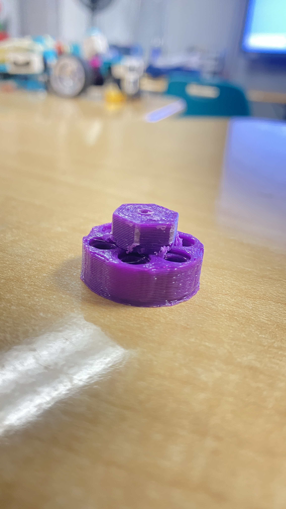

3D Models taken off the internet
===
Differential:
https://www.printables.com/model/36860-lego-differential-v2

3D Models made In House
===
1/10 Scale RC Car to Lego Technic Wheel Hub
It's currently printed in Dremel's PLA plastic on a Dremel 3D45 with the technic wholes drilled out to fit technic pins correctly:
](<wheel adapter picture.jpg>)