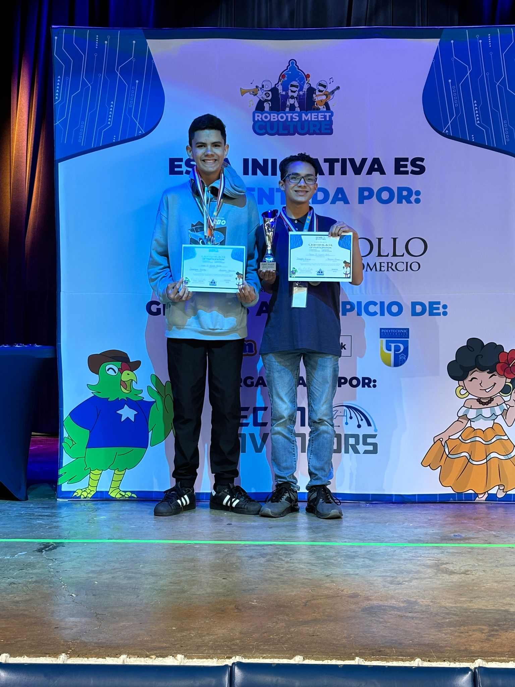

About Us
===
](<1st place at robinson.jpg>)

We are Conagher Racing, a small two-man team from Puerto Rico with a passion for robots. We participate in the Future Engineers category of the World Robot Olympiad and we both strive to reach great places in the near future.

First member, Luis:

Second member, César:
Hello, im César J. García Ortiz, I am the rookie programmer of Conagher Racing, and am tasked mostly with coming up with ideas or strategies in where our robot could prevail in competitions. Im open minded and not afraid to show my perspective on things. Well, uh, that's me!